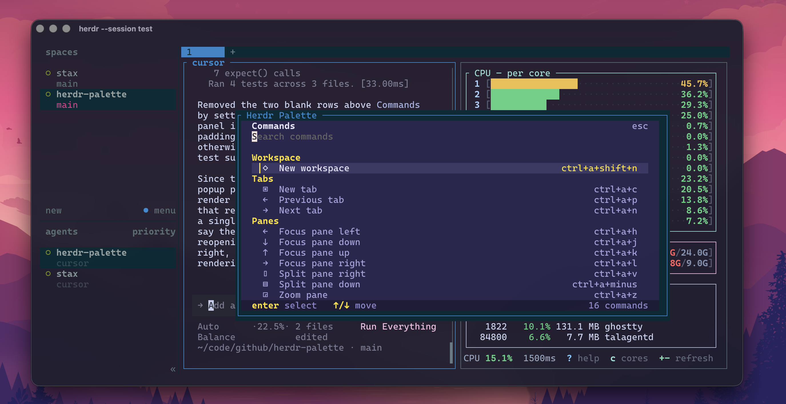

# Herdr Palette

Herdr Palette is a popup command palette for [Herdr](https://herdr.dev). It
fuzzy-finds supported Herdr actions, shows each action's effective shortcut,
and runs the action directly through Herdr's documented API-backed CLI.



The palette is a shortcut-learning aid as well as a fallback when you forget a
binding. It uses Bun and OpenTUI for a fast, polished terminal interface.

## Install

Install the plugin from GitHub:

```sh
herdr plugin install cesarferreira/herdr-palette
```

Install [Bun](https://bun.sh), then link the checkout for local development:

```sh
bun install && herdr plugin link .
```

## Open the palette

Add this direct binding to Herdr's `config.toml`:

```toml
[[keys.command]]
key = "ctrl+space"
type = "shell"
command = "\"$HERDR_BIN_PATH\" plugin pane open --plugin cesarferreira.herdr-palette --entrypoint picker"
description = "Open Herdr Palette"
```

This uses Herdr's supported `shell` custom-command binding to call its
documented `plugin pane open` command. The `picker` pane is declared by this
plugin as a popup, so it opens without changing the tiled layout. Reload a
running configuration with:

```sh
herdr server reload-config
```

## Release

Validate the project, bump the minor version, commit, tag, and push:

```sh
make release
```

Use `make release LEVEL=patch` or `LEVEL=major` for a different bump.

## Configuration and scope

The palette reads Herdr's `config.toml`, including `[keys]` remaps, custom
`[[keys.command]]` bindings, and `[theme]`, so it displays your effective
shortcuts and paints itself with your effective theme. Bindings keep the word
`prefix` instead of expanding it to the concrete leader key
(e.g. `prefix+z`, not `ctrl+a+z`). It owns no configuration or durable state
and never writes to your Herdr config.

### Theme

The popup resolves `[theme] name` — plus `auto_switch`'s light/dark partners —
against Herdr's own built-in palettes, then applies `[theme.custom]` on top, the
way Herdr composes them. Switch themes (or let the day turn) and the next time
you open the palette it matches.

Two colors cannot be discovered from inside a plugin pane: Herdr exposes no theme
API, and a `reset` token means "whatever the host terminal is" — Herdr answers
neither OSC 4 nor OSC 10/11, so there is nothing to query. Those slots fall back
to neutral colors picked from the theme's own light/dark family, which keeps the
`terminal` theme readable at the cost of not tracking a custom host palette
exactly. An unreadable config falls back to Herdr's default, catppuccin.

Built-in palettes are vendored in `src/herdr-palettes.json`: theme colors transcribed from the
`Palette` constructors and `from_name` in [Herdr's `src/app/state.rs`](https://github.com/herdrdev/herdr/blob/master/src/app/state.rs),
name aliases from `canonical_theme_name` in `src/config/theme.rs`. After a Herdr release that
changes themes, update it by hand — a test pins the file's shape, so a missed token, a mistyped
color, or an alias pointing nowhere fails loudly.

Only actions documented by Herdr and backed by its CLI/API run directly from the
palette, including rename, close, workspace/agent navigation, resize, swap, move
pane, and worktree create/open/remove. Commands that need text (rename, open
worktree, remove confirmation) prompt inside the palette before running. Herdr's
UI-only commands — cycle/last pane, the shortcut guide, settings, copy mode, and
detach — have no CLI equivalent, so enter reports the shortcut to press instead.
Custom commands from your configuration are shown as documentation only; their
execution semantics remain owned by Herdr. A failing Herdr command shows its
error and leaves the palette open.
