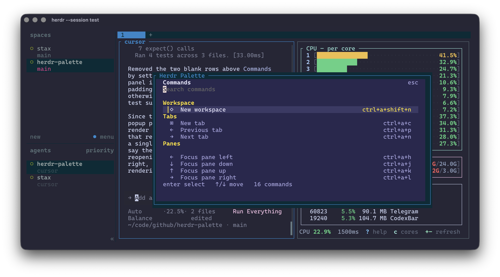

# Herdr Palette

Herdr Palette is a popup command palette for [Herdr](https://herdr.dev). It
fuzzy-finds supported Herdr actions, shows each action's effective shortcut,
and runs the action directly through Herdr's documented API-backed CLI.



The palette is a shortcut-learning aid as well as a fallback when you forget a
binding. It uses Bun and OpenTUI for a fast, polished terminal interface.

## Install

Install the plugin from GitHub:

```sh
herdr plugin install cesarferreira/herdr-palette
```

Install [Bun](https://bun.sh), then link the checkout for local development:

```sh
bun install && herdr plugin link .
```

## Open the palette

Add this direct binding to Herdr's `config.toml`:

```toml
[[keys.command]]
key = "ctrl+space"
type = "shell"
command = "\"$HERDR_BIN_PATH\" plugin pane open --plugin cesarferreira.herdr-palette --entrypoint picker"
description = "Open Herdr Palette"
```

This uses Herdr's supported `shell` custom-command binding to call its
documented `plugin pane open` command. The `picker` pane is declared by this
plugin as a popup, so it opens without changing the tiled layout. Reload a
running configuration with:

```sh
herdr server reload-config
```

## Release

Validate the project, bump the minor version, commit, tag, and push:

```sh
make release
```

Use `make release LEVEL=patch` or `LEVEL=major` for a different bump.

## Configuration and scope

The palette reads Herdr's `config.toml`, including `[keys]` remaps and custom
`[[keys.command]]` bindings, so it displays your effective shortcuts. It owns
no configuration or durable state and never writes to your Herdr config.

Only actions documented by Herdr and backed by its CLI/API are available for
direct execution. Custom commands from your configuration are shown as
documentation only; their execution semantics remain owned by Herdr.
